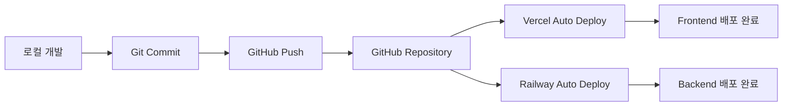

# 📚 VideoPlanet 배포 가이드

## 🚀 배포 아키텍처

VideoPlanet 프로젝트는 **자동 배포 파이프라인**을 통해 GitHub 푸시 시 자동으로 배포됩니다.



---

## 🏗️ 배포 인프라

### Frontend - Vercel
- **URL**: https://videoprompt.vercel.app
- **빌드 명령어**: `pnpm build`
- **출력 디렉토리**: `.next`
- **Node 버전**: 20.x
- **자동 배포 브랜치**: `main`

### Backend - Railway
- **URL**: https://videoprompt-production.up.railway.app
- **데이터베이스**: PostgreSQL
- **빌드 명령어**: `pnpm prisma generate && pnpm build`
- **시작 명령어**: `pnpm start`
- **자동 배포 브랜치**: `main`

---

## 📋 배포 프로세스

### 1. 사전 체크리스트

배포 전 다음 사항을 확인하세요:

- [ ] 모든 테스트 통과 (`pnpm test`)
- [ ] 타입 체크 통과 (`pnpm typecheck`)
- [ ] 린트 체크 통과 (`pnpm lint`)
- [ ] 환경변수 설정 확인
- [ ] 데이터베이스 마이그레이션 준비

### 2. 배포 절차

#### Step 1: 변경사항 확인
```bash
# Git 상태 확인
git status

# 변경된 파일 요약
git diff --stat

# 최근 커밋 확인
git log --oneline -5
```

#### Step 2: 커밋 생성
```bash
# 모든 변경사항 스테이징
git add -A

# Conventional Commits 형식으로 커밋
git commit -m "feat: 기능 설명

- 세부 변경사항 1
- 세부 변경사항 2

🤖 Generated with Claude Code
Co-Authored-By: Claude <noreply@anthropic.com>"
```

#### Step 3: GitHub 푸시
```bash
# main 브랜치로 푸시
git push origin main
```

#### Step 4: 배포 자동 시작
- GitHub 푸시 완료 시 Vercel과 Railway가 자동으로 배포 시작
- 별도의 수동 작업 불필요

---

## 🔧 환경변수 관리

### Vercel 환경변수 (Frontend)

| 변수명 | 설명 | 예시 |
|--------|------|------|
| `NEXT_PUBLIC_API_URL` | API 엔드포인트 | `https://videoprompt-production.up.railway.app` |
| `NEXT_PUBLIC_ENABLE_CINEGENIUS_V3` | CineGenius v3 활성화 | `true` |
| `GOOGLE_GEMINI_API_KEY` | Gemini API 키 | `AIza...` |

### Railway 환경변수 (Backend)

| 변수명 | 설명 | 예시 |
|--------|------|------|
| `DATABASE_URL` | PostgreSQL 연결 문자열 | `postgresql://...` |
| `JWT_SECRET` | JWT 시크릿 키 | `secure-random-string` |
| `SENDGRID_API_KEY` | SendGrid API 키 | `SG.xxx...` |
| `DEFAULT_FROM_EMAIL` | 기본 발신 이메일 | `service@vlanet.net` |

---

## 📊 배포 모니터링

### Vercel Dashboard
- **URL**: https://vercel.com/dashboard
- **모니터링 항목**:
  - 빌드 상태
  - 빌드 로그
  - 함수 실행 로그
  - 성능 메트릭

### Railway Dashboard
- **URL**: https://railway.app/dashboard
- **모니터링 항목**:
  - 서비스 상태
  - 로그 스트림
  - 리소스 사용량
  - 데이터베이스 메트릭

---

## 🚨 트러블슈팅

### 빌드 실패 시

#### Vercel 빌드 오류
```bash
# 로컬에서 빌드 테스트
pnpm build

# 타입 체크
pnpm typecheck

# 환경변수 확인
vercel env pull
```

#### Railway 빌드 오류
```bash
# Prisma 스키마 검증
pnpm prisma validate

# 마이그레이션 생성
pnpm prisma migrate dev

# 로컬 프로덕션 빌드 테스트
NODE_ENV=production pnpm build
```

### 런타임 오류 시

1. **로그 확인**
   - Vercel: Functions 탭에서 로그 확인
   - Railway: Logs 탭에서 실시간 로그 확인

2. **환경변수 검증**
   - 모든 필수 환경변수가 설정되었는지 확인
   - 프로덕션/개발 환경 구분 확인

3. **데이터베이스 연결**
   - DATABASE_URL이 올바른지 확인
   - PostgreSQL 서비스 상태 확인

---

## 🔄 롤백 절차

### Git 롤백
```bash
# 이전 커밋으로 롤백
git revert HEAD
git push origin main

# 특정 커밋으로 롤백
git revert <commit-hash>
git push origin main
```

### Vercel 롤백
1. Vercel Dashboard 접속
2. Deployments 탭 선택
3. 이전 성공 배포 선택
4. "Promote to Production" 클릭

### Railway 롤백
1. Railway Dashboard 접속
2. 서비스 선택
3. Deployments 탭 선택
4. 이전 성공 배포의 "Redeploy" 클릭

---

## 📈 성능 최적화

### 빌드 최적화
- Turbopack 사용 (`next dev --turbopack`)
- 불필요한 의존성 제거
- Tree shaking 활용

### 배포 최적화
- Edge Functions 활용
- 정적 페이지 사전 생성
- 이미지 최적화 (Next.js Image)

---

## 🔐 보안 체크리스트

- [ ] 환경변수에 민감 정보 포함 여부 확인
- [ ] API 키 노출 여부 확인
- [ ] CORS 설정 확인
- [ ] Rate limiting 설정
- [ ] SQL Injection 방지 (Prisma 사용)
- [ ] XSS 방지 (React 기본 제공)

---

## 📝 배포 로그 예시

### 성공적인 배포 로그
```
[10:30:15] Starting deployment...
[10:30:16] Cloning repository...
[10:30:18] Installing dependencies with pnpm...
[10:30:45] Running build script...
[10:31:23] Build completed successfully
[10:31:24] Deploying to production...
[10:31:35] Deployment successful!
[10:31:36] URL: https://videoprompt.vercel.app
```

### 실패한 배포 로그
```
[10:30:15] Starting deployment...
[10:30:16] Cloning repository...
[10:30:18] Installing dependencies with pnpm...
[10:30:45] Running build script...
[10:30:52] Type error: Property 'id' does not exist
[10:30:52] Build failed
[10:30:53] Deployment aborted
```

---

## 🤝 팀 협업

### 배포 권한
- **GitHub**: main 브랜치 보호 규칙 적용
- **Vercel**: 팀 멤버 초대 및 권한 설정
- **Railway**: 프로젝트 멤버 관리

### 배포 알림
- Slack/Discord 웹훅 설정
- 배포 성공/실패 알림
- 성능 저하 알림

---

## 📅 배포 일정

### 정기 배포
- **프로덕션 배포**: 매주 화요일, 목요일
- **핫픽스**: 필요 시 즉시 배포

### 배포 윈도우
- **권장 시간**: 오전 10시 - 오후 6시
- **금지 시간**: 금요일 오후, 주말

---

## 📚 참고 문서

- [Vercel Documentation](https://vercel.com/docs)
- [Railway Documentation](https://docs.railway.app)
- [Next.js Deployment](https://nextjs.org/docs/deployment)
- [Prisma Deployment](https://www.prisma.io/docs/guides/deployment)

---

> 📌 **Note**: 이 문서는 지속적으로 업데이트됩니다. 최신 배포 프로세스는 이 문서를 참고하세요.

> ⚠️ **Important**: 프로덕션 배포 전 반드시 스테이징 환경에서 테스트를 진행하세요.