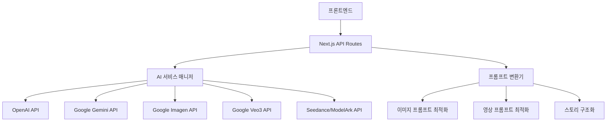

# VideoPrompt 외부 LLM API 아키텍처 기술 문서

## 📋 개요

VideoPrompt 서비스는 여러 외부 LLM API를 통합하여 AI 기반 영상 콘텐츠 생성 플랫폼을 구현합니다. 이 문서는 외부 LLM API가 개입되는 핵심 기술 부분을 상세히 설명합니다.

## 🏗️ 전체 아키텍처

### 1. API 통합 구조



### 2. 핵심 컴포넌트

- **AI 서비스 매니저** (`src/lib/ai-client.ts`): 다중 LLM API 통합 관리
- **프롬프트 변환기**: 용도별 프롬프트 최적화
- **API 라우트**: Next.js API 엔드포인트
- **프로바이더**: 각 AI 서비스별 구현체

## 🔧 핵심 기술 구현

### 1. AI 서비스 매니저 (AIServiceManager)

#### 1.1 다중 LLM API 통합

```typescript
export class AIServiceManager {
  private openaiClient: OpenAIClient | null = null;
  private geminiClient: GeminiClient | null = null;

  async generateScenePrompt(
    request: AIGenerationRequest,
    preferredService: 'openai' | 'gemini' = 'openai',
  ): Promise<AIGenerationResponse> {
    // 1. 선호 서비스 시도
    if (preferredService === 'openai' && this.openaiClient) {
      const result = await this.openaiClient.generateScenePrompt(request);
      if (result.success) return result;
    }

    // 2. 대체 서비스 시도
    if (preferredService === 'openai' && this.geminiClient) {
      return await this.geminiClient.generateScenePrompt(request);
    }

    // 3. 실패 처리
    return { success: false, error: 'No AI service available' };
  }
}
```

#### 1.2 핵심 특징

- **폴백 메커니즘**: 주요 서비스 실패 시 대체 서비스 자동 전환
- **서비스 가용성 검사**: API 키 존재 여부 및 서비스 상태 확인
- **Mock 모드**: 개발/테스트 환경에서 실제 API 없이 동작

### 2. 프롬프트 변환 및 최적화

#### 2.1 용도별 프롬프트 변환

```typescript
// 이미지 생성용 프롬프트 최적화
export async function rewritePromptForImage(imagePrompt: string): Promise<string> {
  const systemPrompt = `You are an award-winning still photographer and image prompt architect. 
  Rewrite the user prompt into a single-image prompt optimized for Imagen/SDXL style: 
  static composition, clear subject, framing (shot/lens implied), lighting, color grading, 
  background, and 6-12 concise tags. English only. No extra commentary.`;

  // OpenAI 또는 Gemini API 호출
  const response = await fetch(apiEndpoint, {
    method: 'POST',
    body: JSON.stringify({
      model: 'gpt-4o-mini',
      messages: [
        { role: 'system', content: systemPrompt },
        { role: 'user', content: imagePrompt }
      ],
      temperature: 0.4
    })
  });
}

// 영상 생성용 프롬프트 최적화
export async function rewritePromptForSeedance(
  videoPrompt: string,
  options: { aspectRatio?: string; duration?: number; style?: string }
): Promise<string> {
  const systemPrompt = `You are an expert video prompt architect for Seedance/ModelArk video generation. 
  Optimize the user prompt for video creation with these requirements:
  - Aspect ratio: ${aspectRatio}
  - Duration: ${duration} seconds
  - Style: ${style}
  - Focus on: dynamic movement, camera motion, temporal flow, visual continuity
  - Include: scene transitions, motion cues, timing beats
  - Avoid: static composition terms, single-frame descriptions`;
}
```

#### 2.2 스토리 구조화

```typescript
// 4단계 스토리 구조 생성
export async function generateStorySteps(storyData: StoryRequest): Promise<StoryResponse> {
  const prompt = `다음 스토리를 바탕으로 4단계 시나리오 구조를 생성해주세요:
  
  스토리: ${storyData.story}
  장르: ${storyData.genre}
  톤앤매너: ${storyData.tone}
  전개 방식: ${storyData.developmentMethod}
  
  다음 JSON 형식으로 응답해주세요:
  {
    "structure": {
      "act1": { "title": "...", "description": "...", "key_elements": [...], "emotional_arc": "..." },
      "act2": { "title": "...", "description": "...", "key_elements": [...], "emotional_arc": "..." },
      "act3": { "title": "...", "description": "...", "key_elements": [...], "emotional_arc": "..." },
      "act4": { "title": "...", "description": "...", "key_elements": [...], "emotional_arc": "..." }
    },
    "visual_style": [...],
    "mood_palette": [...],
    "technical_approach": [...],
    "target_audience_insights": [...]
  }`;

  const response = await fetch('https://generativelanguage.googleapis.com/v1beta/models/gemini-pro:generateContent', {
    method: 'POST',
    headers: { 'Content-Type': 'application/json' },
    body: JSON.stringify({
      contents: [{ parts: [{ text: prompt }] }],
      generationConfig: { temperature: 0.7 }
    })
  });
}
```

### 3. API 라우트 구현

#### 3.1 스토리 생성 API

```typescript
// /api/ai/generate-story/route.ts
export async function POST(request: NextRequest) {
  const body: StoryRequest = await request.json();
  const { story, genre, tone, target, duration, format, tempo, developmentMethod } = body;

  // Google Gemini API 호출
  const response = await fetch(
    `https://generativelanguage.googleapis.com/v1beta/models/gemini-pro:generateContent?key=${geminiApiKey}`,
    {
      method: 'POST',
      headers: { 'Content-Type': 'application/json' },
      body: JSON.stringify({
        contents: [{
          parts: [{
            text: `다음 스토리를 바탕으로 4단계 시나리오 구조를 생성해주세요:
            
            스토리: ${story}
            장르: ${genre}
            톤앤매너: ${tone}
            전개 방식: ${developmentMethod}
            
            ${getDevelopmentMethodPrompt(developmentMethod)}
            
            다음 JSON 형식으로 응답해주세요: ...`
          }]
        }]
      })
    }
  );

  if (response.ok) {
    const data = await response.json();
    const generatedText = data.candidates[0]?.content?.parts[0]?.text;
    
    try {
      const parsedResponse = JSON.parse(generatedText);
      return NextResponse.json(parsedResponse);
    } catch (parseError) {
      // JSON 파싱 실패 시 기본 구조 반환
      return NextResponse.json(generateDefaultStructure(story, genre, tone, target, developmentMethod));
    }
  }
}
```

#### 3.2 프롬프트 생성 API

```typescript
// /api/ai/generate-prompt/route.ts
export async function POST(request: NextRequest) {
  const body: PromptRequest = await request.json();
  const { story, scenario, visual_preferences, target_audience } = body;

  const response = await fetch(
    `https://generativelanguage.googleapis.com/v1beta/models/gemini-pro:generateContent?key=${geminiApiKey}`,
    {
      method: 'POST',
      headers: { 'Content-Type': 'application/json' },
      body: JSON.stringify({
        contents: [{
          parts: [{
            text: `다음 정보를 바탕으로 영상 제작을 위한 체계적인 프롬프트를 생성해주세요:
            
            스토리: ${story}
            장르: ${scenario.genre}
            톤앤매너: ${scenario.tone}
            타겟 오디언스: ${target_audience}
            시각적 선호도: ${visual_preferences.style.join(', ')}
            
            다음 JSON 형식으로 응답해주세요:
            {
              "base_style": { "visual_style": [...], "genre": [...], "mood": [...], "quality": [...] },
              "spatial_context": { "weather": [...], "lighting": [...] },
              "camera_setting": { "primary_lens": [...], "dominant_movement": [...] },
              "core_object": { "material": [...] },
              "timeline": { "angle": [...], "move": [...], "pacing": [...], "audio_quality": [...] },
              "final_prompt": "최종 프롬프트 텍스트",
              "negative_prompt": "제외할 요소들",
              "keywords": ["키워드1", "키워드2", "키워드3"]
            }`
          }]
        }]
      })
    }
  );
}
```

### 4. 이미지 생성 API 통합

#### 4.1 Google Imagen API

```typescript
// src/lib/providers/imagen.ts
export async function generateImagenPreview(options: ImagenPreviewOptions): Promise<{ images: string[] }> {
  const { prompt, size = '768x768', n = 1 } = options;
  
  // 다중 API 시도 (우선순위: OpenAI → Vertex AI → Google AI Studio)
  const attempts = [
    {
      description: 'Imagen 4.0 Fast (최신)',
      url: `https://generativelanguage.googleapis.com/v1beta/models/imagen-4.0-fast-generate-preview-06-06:generateContent?key=${apiKey}`,
      body: {
        contents: [{ role: 'user', parts: [{ text: prompt.slice(0, 1500) }] }],
        generationConfig: { temperature: 0.7, topK: 40, topP: 0.95, maxOutputTokens: 1024 },
        imageGenerationConfig: {
          numberOfImages: Math.max(1, Math.min(4, n)),
          aspectRatio: width > height ? 'LANDSCAPE' : width < height ? 'PORTRAIT' : 'SQUARE',
          imageSize: `${width}x${height}`
        }
      }
    },
    // 추가 시도들...
  ];

  for (const attempt of attempts) {
    const response = await fetch(attempt.url, {
      method: 'POST',
      headers: { 'Content-Type': 'application/json' },
      body: JSON.stringify(attempt.body)
    });

    if (response.ok) {
      const json = await response.json();
      const images = extractImagesFromResponse(json);
      if (images.length > 0) return { images: images.slice(0, n) };
    }
  }

  // 모든 시도 실패 시 플레이스홀더 반환
  return { images: generatePlaceholderImages(prompt, size, n) };
}
```

#### 4.2 이미지 응답 처리

```typescript
function extractImagesFromResponse(json: any): string[] {
  const images: string[] = [];

  // 다양한 응답 구조 대응
  if (json.candidates && Array.isArray(json.candidates)) {
    for (const candidate of json.candidates) {
      if (candidate.content && candidate.content.parts) {
        for (const part of candidate.content.parts) {
          if (part.inlineData && part.inlineData.mimeType && part.inlineData.data) {
            images.push(`data:${part.inlineData.mimeType};base64,${part.inlineData.data}`);
          }
        }
      }
    }
  } else if (json.predictions && Array.isArray(json.predictions)) {
    for (const prediction of json.predictions) {
      if (prediction.bytesBase64Encoded) {
        images.push(`data:image/png;base64,${prediction.bytesBase64Encoded}`);
      }
    }
  }

  return images;
}
```

### 5. 영상 생성 API 통합

#### 5.1 Seedance/ModelArk API

```typescript
// src/lib/providers/seedance.ts
export async function createSeedanceVideo(payload: SeedanceCreatePayload): Promise<SeedanceCreateResult> {
  const apiKey = process.env.SEEDANCE_API_KEY || process.env.MODELARK_API_KEY || '';
  
  if (!apiKey) {
    return { ok: false, error: 'Seedance API 키가 설정되지 않았습니다.' };
  }

  // Ark v3 API 스펙에 맞춘 요청 구성
  const body = {
    model: modelId,
    content: [{ type: 'text', text: payload.prompt }],
    parameters: {
      aspect_ratio: payload.aspect_ratio || '16:9',
      duration: payload.duration_seconds || 8,
      seed: payload.seed || Math.floor(Math.random() * 1000000),
      quality: payload.quality || 'standard'
    }
  };

  // 이미지 URL이 있는 경우 추가 (image-to-video)
  if (payload.image_url) {
    body.content.push({
      type: 'image_url',
      image_url: { url: payload.image_url }
    });
  }

  const response = await fetch(url, {
    method: 'POST',
    headers: {
      Authorization: `Bearer ${apiKey}`,
      'Content-Type': 'application/json',
      'User-Agent': 'VideoPlanet/1.0'
    },
    body: JSON.stringify(body),
    signal: controller.signal
  });

  const responseText = await response.text();
  const jsonResponse = JSON.parse(responseText);
  
  const jobId = extractJobId(jsonResponse);
  return {
    ok: true,
    jobId,
    status: 'queued',
    dashboardUrl: jsonResponse.dashboardUrl
  };
}
```

#### 5.2 Google Veo3 API

```typescript
// src/lib/providers/veo.ts
export async function generateVeoVideo(options: VeoVideoOptions): Promise<VeoVideoResponse> {
  const { prompt, aspectRatio = '16:9', duration = 8, model = 'veo-3.0-generate-preview' } = options;
  
  const apiKey = process.env.GOOGLE_AI_STUDIO_API_KEY || process.env.GOOGLE_API_KEY;
  
  if (!apiKey) {
    return { ok: false, error: 'Google AI Studio API key is not configured.' };
  }

  const url = `https://generativelanguage.googleapis.com/v1beta/models/${model}:generateContent?key=${apiKey}`;
  
  const requestBody = {
    contents: [{ parts: [{ text: prompt }] }],
    generationConfig: {
      temperature: 0.7,
      topK: 40,
      topP: 0.95,
      maxOutputTokens: 2048
    },
    videoGenerationConfig: {
      aspectRatio: aspectRatio,
      duration: `${duration}s`,
      personGeneration: 'dont_allow'
    }
  };

  const response = await fetch(url, {
    method: 'POST',
    headers: { 'Content-Type': 'application/json' },
    body: JSON.stringify(requestBody)
  });

  const responseText = await response.text();
  const jsonResponse = JSON.parse(responseText);
  
  const operationId = jsonResponse?.operationId || jsonResponse?.operation?.name;
  return {
    ok: true,
    operationId,
    status: 'pending',
    progress: 0
  };
}
```

### 6. 에러 처리 및 폴백 메커니즘

#### 6.1 다단계 폴백 시스템

```typescript
// 영상 생성 API의 폴백 시스템
export async function POST(req: NextRequest) {
  const { prompt, duration, aspectRatio, provider = 'auto' } = await req.json();

  // 1단계: Seedance API 시도
  if (provider === 'auto' || provider === 'seedance') {
    try {
      const seedanceRes = await fetch('/api/seedance/create', {
        method: 'POST',
        body: JSON.stringify({ prompt, duration_seconds: duration, aspect_ratio: aspectRatio })
      });
      
      if (seedanceRes.ok) {
        const data = await seedanceRes.json();
        if (data.ok) return NextResponse.json({ ok: true, provider: 'seedance', ...data });
      }
    } catch (error) {
      console.error('Seedance API 호출 실패:', error);
    }
  }

  // 2단계: Veo3 API 시도
  if (provider === 'auto' || provider === 'veo') {
    try {
      const veoRes = await fetch('/api/veo/create', {
        method: 'POST',
        body: JSON.stringify({ prompt, duration, aspectRatio, model: 'veo-3.0-generate-preview' })
      });
      
      if (veoRes.ok) {
        const data = await veoRes.json();
        if (data.ok) return NextResponse.json({ ok: true, provider: 'veo3', ...data });
      }
    } catch (error) {
      console.error('Veo3 API 호출 실패:', error);
    }
  }

  // 3단계: Mock 영상 생성 (최종 폴백)
  const mockVideo = generateMockVideo(prompt, duration, aspectRatio);
  return NextResponse.json({
    ok: true,
    provider: 'mock',
    videoUrl: mockVideo,
    message: '실제 영상 생성 API가 실패하여 Mock 영상이 생성되었습니다.'
  });
}
```

#### 6.2 타임아웃 및 재시도 로직

```typescript
// 타임아웃이 있는 fetch 래퍼
async function fetchWithTimeout(
  input: RequestInfo | URL, 
  init: RequestInit & { timeoutMs?: number } = {}
) {
  const { timeoutMs = 20000, ...rest } = init as any;
  const controller = new AbortController();
  const id = setTimeout(() => controller.abort(), timeoutMs);
  
  try {
    return await fetch(input, { ...rest, signal: controller.signal });
  } finally {
    clearTimeout(id);
  }
}

// 재시도 로직이 있는 API 호출
async function apiRequestWithRetry(
  url: string,
  options: RequestInit,
  retryAttempts: number = 3,
  retryDelay: number = 2000
): Promise<Response> {
  for (let attempt = 1; attempt <= retryAttempts; attempt++) {
    try {
      const response = await fetchWithTimeout(url, { ...options, timeoutMs: 60000 });
      
      if (response.ok) return response;
      
      if (attempt === retryAttempts) {
        throw new Error(`API request failed after ${retryAttempts} attempts: ${response.status}`);
      }
      
      await new Promise(resolve => setTimeout(resolve, retryDelay * attempt));
    } catch (error) {
      if (attempt === retryAttempts) throw error;
      await new Promise(resolve => setTimeout(resolve, retryDelay * attempt));
    }
  }
  
  throw new Error('Max retry attempts exceeded');
}
```

### 7. 환경 변수 및 설정 관리

#### 7.1 필수 환경 변수

```bash
# Google AI Services
GOOGLE_GEMINI_API_KEY=your_gemini_api_key
GOOGLE_AI_STUDIO_API_KEY=your_ai_studio_key

# OpenAI
OPENAI_API_KEY=your_openai_api_key

# Seedance/ModelArk
SEEDANCE_API_KEY=your_seedance_api_key
SEEDANCE_API_BASE=https://ark.ap-southeast.bytepluses.com
SEEDANCE_MODEL=ep-your-model-id

# Image Generation
IMAGEN_PROVIDER=google
IMAGEN_LLM_MODEL=imagen-4.0-fast-generate-preview-06-06

# Video Generation
VEO_PROVIDER=google
VEO_MODEL=veo-3.0-generate-preview
```

#### 7.2 설정 검증

```typescript
// 환경 변수 검증 및 서비스 가용성 확인
export const createAIServiceManager = (): AIServiceManager => {
  const config: AIServiceConfig = {
    openai: {
      apiKey: process.env.OPENAI_API_KEY || '',
      model: 'gpt-4o-mini',
      maxTokens: 800,
      temperature: 0.6
    },
    gemini: {
      apiKey: process.env.GOOGLE_GEMINI_API_KEY || '',
      model: 'gemini-1.5-flash',
      temperature: 0.6,
      maxOutputTokens: 1024
    }
  };

  // Mock 모드: 키가 없거나 NEXT_PUBLIC_ENABLE_MOCK_API=true 인 경우
  const isMock = process.env.NEXT_PUBLIC_ENABLE_MOCK_API === 'true' || 
                 (!config.openai.apiKey && !config.gemini.apiKey);
  
  if (isMock) {
    return new MockManager();
  }

  return new AIServiceManager(config);
};
```

## 🔄 데이터 흐름

### 1. 스토리 생성 플로우

```
사용자 입력 → 프론트엔드 → /api/ai/generate-story → Google Gemini API → JSON 파싱 → 4단계 구조 반환
```

### 2. 프롬프트 생성 플로우

```
스토리 데이터 → /api/ai/generate-prompt → Google Gemini API → 구조화된 프롬프트 → 프론트엔드
```

### 3. 이미지 생성 플로우

```
프롬프트 → 프롬프트 최적화 → Google Imagen API → Base64 이미지 → 프론트엔드 표시
```

### 4. 영상 생성 플로우

```
프롬프트 → 프롬프트 최적화 → Seedance/Veo3 API → Job ID → 상태 폴링 → 영상 URL
```

## 🛡️ 보안 및 성능 고려사항

### 1. API 키 보안

- 모든 API 키는 서버 사이드 환경 변수에서만 사용
- 클라이언트에 API 키 노출 금지
- Railway/Vercel 환경 변수로 안전하게 관리

### 2. 요청 제한 및 레이트 리미팅

```typescript
// 사용자별 요청 제한
const rateLimit = {
  storyGeneration: { perMinute: 3, perHour: 10 },
  imageGeneration: { perMinute: 5, perHour: 20 },
  videoGeneration: { perMinute: 2, perHour: 5 }
};
```

### 3. 에러 처리 및 로깅

```typescript
// 구조화된 에러 로깅
console.log('DEBUG: API 호출 시작:', {
  endpoint: url,
  hasApiKey: !!apiKey,
  prompt: prompt.slice(0, 100),
  timestamp: new Date().toISOString()
});

console.error('DEBUG: API 호출 실패:', {
  error: error.message,
  status: response?.status,
  attempt: attemptNumber,
  timestamp: new Date().toISOString()
});
```

### 4. 성능 최적화

- **병렬 처리**: 여러 API 동시 호출
- **캐싱**: 동일한 요청에 대한 응답 캐싱
- **타임아웃**: 장시간 대기 방지
- **폴백**: 주요 서비스 실패 시 대체 서비스 사용

## 📊 모니터링 및 디버깅

### 1. API 상태 모니터링

```typescript
// API 상태 확인 엔드포인트
export async function GET() {
  const services = {
    openai: !!process.env.OPENAI_API_KEY,
    gemini: !!process.env.GOOGLE_GEMINI_API_KEY,
    seedance: !!process.env.SEEDANCE_API_KEY,
    veo: !!process.env.GOOGLE_AI_STUDIO_API_KEY
  };

  return NextResponse.json({
    status: 'ok',
    services,
    timestamp: new Date().toISOString()
  });
}
```

### 2. 디버깅 로그

- 모든 API 호출에 대한 상세 로그
- 요청/응답 데이터 추적
- 에러 발생 시 스택 트레이스
- 성능 메트릭 수집

## 🚀 확장성 고려사항

### 1. 새로운 AI 서비스 추가

```typescript
// 새로운 AI 서비스 추가 시 확장 가능한 구조
interface AIService {
  generateScenePrompt(request: AIGenerationRequest): Promise<AIGenerationResponse>;
  enhancePrompt(existingPrompt: string, feedback: string): Promise<AIGenerationResponse>;
  isAvailable(): boolean;
}

class NewAIService implements AIService {
  // 구현...
}
```

### 2. 프롬프트 템플릿 시스템

```typescript
// 프롬프트 템플릿 관리
const promptTemplates = {
  story: {
    drama: '드라마 스토리 생성 템플릿...',
    comedy: '코미디 스토리 생성 템플릿...',
    action: '액션 스토리 생성 템플릿...'
  },
  image: {
    cinematic: '시네마틱 이미지 프롬프트 템플릿...',
    realistic: '리얼리스틱 이미지 프롬프트 템플릿...'
  },
  video: {
    seedance: 'Seedance 영상 프롬프트 템플릿...',
    veo: 'Veo 영상 프롬프트 템플릿...'
  }
};
```

## 📝 결론

VideoPrompt의 외부 LLM API 아키텍처는 다음과 같은 핵심 특징을 가집니다:

1. **다중 API 통합**: OpenAI, Google Gemini, Imagen, Veo3, Seedance 등 다양한 AI 서비스 통합
2. **폴백 메커니즘**: 주요 서비스 실패 시 자동으로 대체 서비스 사용
3. **프롬프트 최적화**: 용도별(이미지/영상) 프롬프트 자동 최적화
4. **에러 처리**: 포괄적인 에러 처리 및 사용자 친화적 메시지
5. **확장성**: 새로운 AI 서비스 추가가 용이한 구조
6. **성능**: 타임아웃, 재시도, 캐싱 등을 통한 성능 최적화

이러한 아키텍처를 통해 안정적이고 확장 가능한 AI 기반 영상 콘텐츠 생성 플랫폼을 구현할 수 있습니다.
