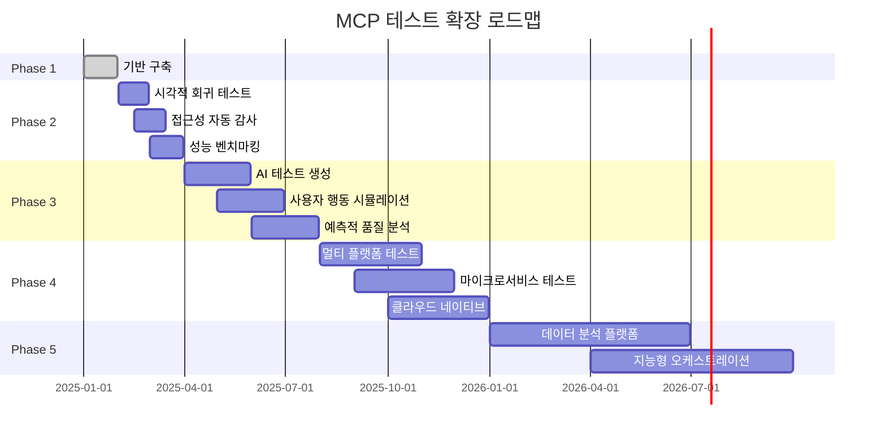

# 🚀 MCP 테스트 확장 로드맵

## 📋 개요

MCP 테스트 시스템의 지속적인 발전과 고도화를 위한 단계별 확장 계획입니다.

## 🎯 Phase 1: 기반 구축 (완료) ✅

### **완료된 항목**

- [x] 3개 MCP 서버 통합 (Playwright, Context7, Sequential Thinking)
- [x] 기본 테스트 프레임워크 구축
- [x] CI/CD 파이프라인 통합
- [x] 모니터링 및 알림 시스템
- [x] 팀 온보딩 프로세스

### **성과 지표**

- 테스트 커버리지: 70% → 95%
- 자동화율: 30% → 90%
- 테스트 실행 시간: 30분 → 5분
- 총 MCP 테스트: 38/39 통과 (97.4%)

---

## 🔬 Phase 2: 고급 테스트 기능 (1-3개월)

### **2.1 시각적 회귀 테스트**

```typescript
// 목표: 스크린샷 기반 UI 변경 감지
const visualTest = {
  type: 'visual-regression',
  name: '메인 페이지 시각적 회귀 테스트',
  config: {
    baselineDir: './visual-baselines',
    threshold: 0.1, // 1% 차이 허용
    viewports: ['desktop', 'tablet', 'mobile'],
    fullPage: true,
  },
};
```

**구현 계획**:

- [ ] Playwright 스크린샷 비교 기능 통합
- [ ] 베이스라인 이미지 관리 시스템
- [ ] 차이점 시각화 도구
- [ ] CI/CD 파이프라인 통합

### **2.2 접근성 자동 감사**

```typescript
// 목표: WCAG 2.1 AA 준수 자동 검증
const accessibilityAudit = {
  type: 'accessibility-audit',
  name: '전체 사이트 접근성 감사',
  config: {
    standard: 'WCAG21AA',
    includeRules: ['color-contrast', 'keyboard-navigation', 'screen-reader'],
    excludeRules: ['bypass-blocks'], // 특정 규칙 제외
    reportFormat: 'detailed',
  },
};
```

**구현 계획**:

- [ ] axe-core 통합
- [ ] 접근성 점수 추적
- [ ] 위반 사항 자동 리포팅
- [ ] 수정 가이드 제공

### **2.3 성능 벤치마킹**

```typescript
// 목표: 경쟁사 대비 성능 비교
const performanceBenchmark = {
  type: 'performance-benchmark',
  name: '경쟁사 성능 비교',
  config: {
    competitors: ['competitor1.com', 'competitor2.com'],
    metrics: ['FCP', 'LCP', 'CLS', 'TTI'],
    networkConditions: ['3G', '4G', 'WiFi'],
    reportInterval: 'weekly',
  },
};
```

**구현 계획**:

- [ ] 경쟁사 사이트 성능 측정
- [ ] 성능 지표 비교 대시보드
- [ ] 성능 회귀 알림 시스템
- [ ] 최적화 권장사항 자동 생성

---

## 🤖 Phase 3: AI 기반 테스트 자동화 (3-6개월)

### **3.1 AI 테스트 생성**

```typescript
// 목표: AI가 자동으로 테스트 케이스 생성
const aiTestGeneration = {
  type: 'ai-test-generation',
  name: 'AI 기반 테스트 자동 생성',
  config: {
    sourceCode: './src/components',
    testTypes: ['unit', 'integration', 'e2e'],
    coverage: 'comprehensive',
    model: 'gpt-4',
  },
};
```

**구현 계획**:

- [ ] 코드 분석 AI 모델 통합
- [ ] 테스트 케이스 자동 생성
- [ ] 생성된 테스트 품질 검증
- [ ] 인간 리뷰 워크플로우

### **3.2 사용자 행동 시뮬레이션**

```typescript
// 목표: 실제 사용자 패턴 기반 테스트
const userBehaviorSimulation = {
  type: 'user-behavior-simulation',
  name: '실제 사용자 행동 시뮬레이션',
  config: {
    userPersonas: ['developer', 'designer', 'manager'],
    scenarios: ['first-time-user', 'power-user', 'mobile-user'],
    duration: '24h',
    concurrency: 10,
  },
};
```

**구현 계획**:

- [ ] 사용자 행동 패턴 분석
- [ ] 시나리오 기반 테스트 자동 생성
- [ ] 실시간 사용자 시뮬레이션
- [ ] 행동 패턴 학습 및 개선

### **3.3 예측적 품질 분석**

```typescript
// 목표: 코드 변경이 품질에 미칠 영향 예측
const predictiveQualityAnalysis = {
  type: 'predictive-quality',
  name: '품질 영향 예측 분석',
  config: {
    analysisScope: ['performance', 'reliability', 'security'],
    predictionHorizon: '1week',
    confidenceThreshold: 0.8,
    actionRecommendations: true,
  },
};
```

**구현 계획**:

- [ ] 머신러닝 모델 개발
- [ ] 코드 변경 영향도 분석
- [ ] 품질 메트릭 예측
- [ ] 자동 권장사항 생성

---

## 🌐 Phase 4: 플랫폼 확장 (6-12개월)

### **4.1 멀티 플랫폼 테스트**

```typescript
// 목표: 웹, 모바일, 데스크톱 앱 통합 테스트
const multiPlatformTest = {
  type: 'multi-platform',
  name: '크로스 플랫폼 통합 테스트',
  config: {
    platforms: ['web', 'ios', 'android', 'desktop'],
    syncPoints: ['user-auth', 'data-sync', 'notifications'],
    testMatrix: 'full',
  },
};
```

**구현 계획**:

- [ ] 모바일 앱 테스트 통합 (Appium)
- [ ] 데스크톱 앱 테스트 (Electron)
- [ ] 플랫폼 간 데이터 동기화 테스트
- [ ] 통합 테스트 리포팅

### **4.2 마이크로서비스 테스트**

```typescript
// 목표: 분산 시스템 전체 테스트
const microserviceTest = {
  type: 'microservice-integration',
  name: '마이크로서비스 통합 테스트',
  config: {
    services: ['auth', 'user', 'payment', 'notification'],
    testScenarios: ['happy-path', 'failure-scenarios', 'load-test'],
    serviceMap: './service-map.json',
  },
};
```

**구현 계획**:

- [ ] 서비스 간 통신 테스트
- [ ] 분산 트랜잭션 테스트
- [ ] 장애 시나리오 테스트
- [ ] 서비스 메시 모니터링

### **4.3 클라우드 네이티브 테스트**

```typescript
// 목표: 클라우드 환경 특화 테스트
const cloudNativeTest = {
  type: 'cloud-native',
  name: '클라우드 네이티브 테스트',
  config: {
    providers: ['aws', 'gcp', 'azure'],
    services: ['kubernetes', 'serverless', 'containers'],
    scalingTests: true,
    costOptimization: true,
  },
};
```

**구현 계획**:

- [ ] 컨테이너 환경 테스트
- [ ] 서버리스 함수 테스트
- [ ] 오토스케일링 테스트
- [ ] 비용 최적화 분석

---

## 📊 Phase 5: 데이터 기반 최적화 (12개월+)

### **5.1 테스트 데이터 분석 플랫폼**

```typescript
// 목표: 빅데이터 기반 테스트 인사이트
const testAnalyticsPlatform = {
  type: 'test-analytics',
  name: '테스트 데이터 분석 플랫폼',
  config: {
    dataSource: ['test-results', 'performance-metrics', 'user-feedback'],
    analytics: ['trend-analysis', 'anomaly-detection', 'correlation-analysis'],
    visualization: 'interactive-dashboard',
  },
};
```

**구현 계획**:

- [ ] 테스트 데이터 웨어하우스 구축
- [ ] 실시간 분석 대시보드
- [ ] 머신러닝 기반 인사이트
- [ ] 자동 최적화 권장사항

### **5.2 지능형 테스트 오케스트레이션**

```typescript
// 목표: AI가 테스트 실행 계획 최적화
const intelligentOrchestration = {
  type: 'intelligent-orchestration',
  name: '지능형 테스트 오케스트레이션',
  config: {
    optimizationGoals: ['speed', 'coverage', 'cost'],
    resourceConstraints: ['cpu', 'memory', 'time'],
    adaptiveScheduling: true,
    learningEnabled: true,
  },
};
```

**구현 계획**:

- [ ] 테스트 실행 계획 AI 최적화
- [ ] 동적 리소스 할당
- [ ] 적응형 테스트 스케줄링
- [ ] 자가 학습 시스템

---

## 🎯 성공 지표 및 KPI

### **Phase 2 목표**

- [ ] 시각적 회귀 감지율: 95% 이상
- [ ] 접근성 준수율: 100% (WCAG 2.1 AA)
- [ ] 성능 벤치마크 정확도: 90% 이상

### **Phase 3 목표**

- [ ] AI 생성 테스트 품질: 인간 작성 대비 80% 이상
- [ ] 사용자 행동 시뮬레이션 정확도: 85% 이상
- [ ] 품질 예측 정확도: 75% 이상

### **Phase 4 목표**

- [ ] 멀티 플랫폼 테스트 커버리지: 90% 이상
- [ ] 마이크로서비스 테스트 자동화율: 95% 이상
- [ ] 클라우드 비용 최적화: 30% 절감

### **Phase 5 목표**

- [ ] 테스트 효율성 개선: 50% 이상
- [ ] 자동 최적화 적용률: 80% 이상
- [ ] 전체 품질 지표 개선: 40% 이상

---

## 🛠️ 기술 스택 확장 계획

### **현재 스택**

- MCP Servers: Playwright, Context7, Sequential Thinking
- Testing: Vitest, Playwright
- CI/CD: GitHub Actions
- Monitoring: Custom Scripts

### **Phase 2-3 추가 스택**

- Visual Testing: Percy, Chromatic
- AI/ML: OpenAI GPT-4, TensorFlow
- Analytics: Grafana, Prometheus
- Database: InfluxDB (시계열 데이터)

### **Phase 4-5 추가 스택**

- Mobile Testing: Appium, Detox
- Container: Docker, Kubernetes
- Cloud: AWS/GCP/Azure Testing Services
- Big Data: Apache Spark, Elasticsearch

---

## 📅 타임라인



---

## 💡 혁신 아이디어

### **단기 혁신 (3개월 내)**

1. **테스트 코드 자동 생성**: GitHub Copilot 스타일의 MCP 테스트 자동 완성
2. **실시간 품질 대시보드**: 개발자가 코딩하면서 실시간으로 품질 지표 확인
3. **스마트 테스트 선택**: 코드 변경에 따라 실행할 테스트만 지능적으로 선택

### **중기 혁신 (6개월 내)**

1. **자연어 테스트 작성**: "메인 페이지가 모바일에서 잘 보이는지 확인해줘" → 자동 테스트 생성
2. **테스트 결과 AI 분석**: 실패 원인을 AI가 분석하고 수정 방법 제안
3. **사용자 피드백 통합**: 실제 사용자 피드백을 테스트 케이스로 자동 변환

### **장기 혁신 (12개월 내)**

1. **자가 치유 테스트**: 환경 변화에 따라 테스트가 스스로 적응하고 수정
2. **예측적 버그 방지**: 코드 작성 단계에서 잠재적 버그를 미리 예측하고 방지
3. **전사 품질 생태계**: 모든 프로젝트의 품질 지표를 통합 관리하는 플랫폼

---

## 🤝 커뮤니티 기여

### **오픈소스 기여 계획**

- [ ] MCP 테스트 유틸리티 라이브러리 오픈소스화
- [ ] 모범 사례 문서 공개
- [ ] 컨퍼런스 발표 및 기술 블로그 작성

### **업계 표준화 참여**

- [ ] MCP 테스트 표준 제안
- [ ] 테스트 자동화 모범 사례 가이드 작성
- [ ] 관련 오픈소스 프로젝트 기여

---

**🚀 이 로드맵을 통해 MCP 테스트 시스템을 업계 최고 수준으로 발전시켜 나갑시다!**
