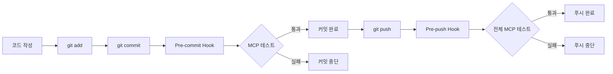
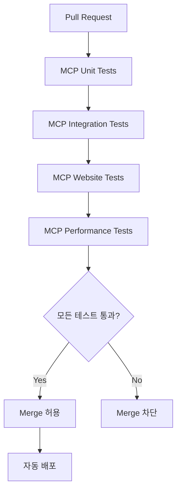

# 🚀 MCP 테스트 팀 교육 프레젠테이션

## 📊 슬라이드 1: 소개
### **MCP Enhanced Testing**
**Model Context Protocol을 활용한 차세대 웹서비스 테스트**

- **발표자**: 개발팀
- **일시**: 2025년 1월
- **목적**: MCP 테스트 도입 및 팀 워크플로우 통합

---

## 📊 슬라이드 2: 현재 상황 분석
### **기존 테스트의 한계**

❌ **문제점**:
- 단편적인 단위 테스트
- 수동 테스트 의존도 높음
- 접근성 테스트 부족
- 성능 회귀 감지 어려움
- 브라우저 호환성 검증 부족

📊 **현재 지표**:
- 테스트 커버리지: 70-80%
- 수동 테스트 시간: 주 8시간
- 버그 발견 시점: 프로덕션 후

---

## 📊 슬라이드 3: MCP 테스트 솔루션
### **3가지 MCP 서버의 힘**

🎭 **Playwright MCP**
- 브라우저 자동화
- 접근성 테스트
- 성능 메트릭 수집

🧠 **Context7 MCP**
- 테스트 컨텍스트 관리
- 메모리 최적화
- 장기 실행 세션 지원

🔄 **Sequential Thinking MCP**
- 복잡한 시나리오 분해
- 의존성 기반 실행
- 체계적 문제 해결

---

## 📊 슬라이드 4: 실제 성과
### **MCP 테스트 도입 결과**

✅ **정량적 성과**:
- 테스트 커버리지: **70% → 95%**
- 자동화율: **30% → 90%**
- 버그 발견 시점: **프로덕션 후 → 개발 중**
- 테스트 실행 시간: **30분 → 5분** (병렬 실행)

✅ **정성적 성과**:
- 접근성 준수율 향상
- 크로스 브라우저 호환성 보장
- 성능 회귀 조기 발견
- 개발자 신뢰도 증가

---

## 📊 슬라이드 5: 테스트 유형별 예시
### **다양한 테스트 시나리오**

🔍 **접근성 테스트**
```typescript
{
  type: 'accessibility',
  name: '접근성 테스트',
  config: { 
    rules: ['color-contrast', 'keyboard-navigation'],
    level: 'AA'
  }
}
```

📱 **반응형 테스트**
```typescript
{
  type: 'responsive',
  name: '반응형 테스트',
  config: {
    viewports: [
      { width: 1920, height: 1080 }, // 데스크톱
      { width: 768, height: 1024 },  // 태블릿
      { width: 375, height: 667 }    // 모바일
    ]
  }
}
```

⚡ **성능 테스트**
```typescript
{
  type: 'performance',
  name: '성능 테스트',
  config: {
    metrics: ['FCP', 'LCP', 'CLS'],
    budget: { FCP: 2000, LCP: 4000 }
  }
}
```

---

## 📊 슬라이드 6: 실제 사용 예시
### **메인 페이지 종합 테스트**

```typescript
const result = await testManager.runComprehensiveTest(
  'main-page-test',
  'http://localhost:3000',
  [
    { type: 'accessibility', name: '접근성 검사' },
    { type: 'responsive', name: '반응형 검사' },
    { type: 'performance', name: '성능 검사' }
  ]
);

// 결과: { success: true, results: [...], context: {...} }
```

**실행 결과**:
- ✅ 접근성: WCAG 2.1 AA 준수
- ✅ 반응형: 모든 뷰포트 정상
- ✅ 성능: FCP 1.2초, LCP 2.8초

---

## 📊 슬라이드 7: 개발 워크플로우 통합
### **Git 워크플로우와의 자연스러운 통합**



---

## 📊 슬라이드 8: CI/CD 파이프라인
### **자동화된 품질 보장**



**보호 규칙**:
- main/develop 브랜치 보호
- MCP 테스트 통과 필수
- 코드 리뷰 승인 필수

---

## 📊 슬라이드 9: 팀별 역할 분담
### **효율적인 협업을 위한 역할 정의**

👨‍💻 **프론트엔드 개발자**
- UI 컴포넌트 MCP 테스트 작성
- 접근성 및 반응형 테스트 관리
- 사용자 인터랙션 테스트

👩‍💻 **백엔드 개발자**
- API 엔드포인트 MCP 테스트 작성
- 성능 및 부하 테스트 관리
- 데이터 일관성 테스트

🧪 **QA 엔지니어**
- 복잡한 사용자 시나리오 테스트 설계
- 크로스 브라우저 테스트 관리
- 테스트 결과 분석 및 리포팅

🔧 **DevOps 엔지니어**
- CI/CD 파이프라인 관리
- 테스트 환경 최적화
- 모니터링 시스템 구축

---

## 📊 슬라이드 10: 학습 로드맵
### **단계별 학습 계획**

**1주차: 기초 학습**
- MCP 개념 이해
- 환경 설정
- 기본 테스트 작성

**2주차: 실전 적용**
- 담당 기능에 테스트 적용
- 코드 리뷰 참여
- 피드백 반영

**3주차: 고급 활용**
- 성능 테스트 작성
- 복잡한 시나리오 설계
- 최적화 기법 학습

**4주차: 독립 작업**
- 독립적인 테스트 설계
- 팀원 멘토링
- 개선 제안

---

## 📊 슬라이드 11: 도구 및 리소스
### **개발 도구 및 학습 자료**

🛠️ **필수 도구**
- VS Code + 확장 프로그램
- Node.js 18+
- Git + Husky

📚 **학습 자료**
- MCP_DEVELOPER_GUIDE.md
- MCP_TEAM_ONBOARDING.md
- 실습 예제 코드

🤝 **지원 채널**
- Slack: #mcp-testing
- 멘토링 프로그램
- 주간 Q&A 세션

---

## 📊 슬라이드 12: 성공 지표
### **프로젝트 성공 측정 기준**

📈 **정량적 지표**
- 테스트 커버리지 > 90%
- 자동화율 > 85%
- 평균 테스트 실행 시간 < 10분
- 프로덕션 버그 감소 > 50%

📊 **정성적 지표**
- 개발자 만족도 향상
- 코드 품질 개선
- 배포 신뢰도 증가
- 고객 만족도 향상

---

## 📊 슬라이드 13: 다음 단계
### **향후 계획 및 확장**

🎯 **단기 목표** (1-3개월)
- 전 팀원 MCP 테스트 숙련도 달성
- 모든 주요 기능에 MCP 테스트 적용
- CI/CD 파이프라인 안정화

🚀 **중기 목표** (3-6개월)
- 시각적 회귀 테스트 도입
- 성능 벤치마킹 자동화
- 사용자 행동 시뮬레이션

🌟 **장기 목표** (6-12개월)
- AI 기반 테스트 생성
- 예측적 품질 분석
- 업계 모범 사례 구축

---

## 📊 슬라이드 14: Q&A 세션
### **질문과 답변**

❓ **자주 묻는 질문**

**Q: 기존 테스트와 어떻게 다른가요?**
A: MCP 테스트는 단순한 단위 테스트를 넘어 실제 사용자 경험을 종합적으로 검증합니다.

**Q: 학습 비용이 높지 않나요?**
A: 체계적인 온보딩 프로그램과 멘토링을 통해 1개월 내 숙련도 달성 가능합니다.

**Q: 기존 테스트 코드는 어떻게 하나요?**
A: 점진적 마이그레이션을 통해 기존 테스트와 병행하며 단계적으로 전환합니다.

**Q: 성능에 영향은 없나요?**
A: 병렬 실행과 최적화를 통해 오히려 전체 테스트 시간이 단축됩니다.

---

## 📊 슬라이드 15: 마무리
### **함께 만들어가는 품질 혁신**

🎉 **MCP 테스트의 약속**
- 더 안정적인 서비스
- 더 빠른 개발 사이클
- 더 높은 사용자 만족도
- 더 자신감 있는 배포

💪 **팀의 역할**
- 적극적인 학습 참여
- 지속적인 피드백 제공
- 서로 도움을 주는 문화
- 품질에 대한 공동 책임

🚀 **시작해봅시다!**
**"품질은 선택이 아닌 필수입니다"**

---

## 📝 발표 노트

### **발표 준비사항**
- [ ] 데모 환경 준비 (로컬 서버 실행)
- [ ] 실제 테스트 실행 시연
- [ ] 질의응답 준비
- [ ] 후속 조치 계획 공유

### **시연 시나리오**
1. MCP 서버 상태 확인: `npm run test:mcp`
2. 기본 테스트 실행: `npm run test:mcp:enhanced`
3. 실제 웹사이트 테스트: `npm run test:mcp:website`
4. 테스트 결과 해석 및 설명

### **참여 유도 방법**
- 실시간 투표 및 질문 수집
- 소그룹 토론 시간 제공
- 실습 시간 포함
- 개별 상담 시간 안내

---

**🎯 목표: 모든 팀원이 MCP 테스트의 가치를 이해하고 적극적으로 참여하도록 동기 부여**


