# VideoPlanet 데이터베이스 ERD

## 테이블 관계도

```mermaid
erDiagram
    USERS {
        uuid id PK
        text email UK "유니크"
        text username UK "유니크, 선택적"
        user_role role "admin/user/guest"
        text display_name
        text avatar_url
        text bio
        integer api_calls_today "비용 안전"
        integer api_calls_this_month "비용 안전"
        bigint storage_usage_bytes
        jsonb preferences
        jsonb notification_settings
        timestamptz created_at
        timestamptz updated_at
        timestamptz last_login_at
        boolean is_deleted "Soft Delete"
        timestamptz deleted_at
    }

    PROFILES {
        uuid id PK
        uuid user_id FK,UK "users.id에 대한 외래키"
        text first_name
        text last_name
        text company
        text job_title
        text phone
        text timezone "기본값: Asia/Seoul"
        text locale "기본값: ko-KR"
        text subscription_plan "free/pro/enterprise"
        timestamptz subscription_expires_at
        integer monthly_api_limit "기본값: 100"
        bigint monthly_storage_limit "기본값: 1GB"
        jsonb social_links
        boolean onboarding_completed
        integer onboarding_step
        timestamptz created_at
        timestamptz updated_at
        boolean is_deleted
        timestamptz deleted_at
    }

    PROJECTS {
        uuid id PK
        uuid user_id FK "users.id에 대한 외래키"
        text title "프로젝트 제목"
        text description
        project_status status "draft/planning/in_progress/completed/archived"
        text thumbnail_url
        jsonb settings "프로젝트 설정"
        jsonb brand_guidelines "브랜드 가이드라인"
        text target_audience
        integer duration_seconds
        uuid[] collaborators "협업자 ID 배열"
        boolean is_public "공개 여부"
        text share_token UK "공유 토큰"
        timestamptz created_at
        timestamptz updated_at
        boolean is_deleted
        timestamptz deleted_at
    }

    STORIES {
        uuid id PK
        uuid project_id FK "projects.id에 대한 외래키"
        uuid user_id FK "users.id에 대한 외래키"
        text title "스토리 제목"
        text content "스토리 내용"
        story_type story_type "advertisement/education/entertainment/corporate/social_media"
        text tone_and_manner
        text target_audience
        text ai_model_used "사용된 AI 모델"
        text prompt_used "사용된 프롬프트"
        jsonb generation_metadata "AI 생성 메타데이터"
        jsonb structured_content "구조화된 스토리 데이터"
        text[] keywords "키워드 배열"
        integer estimated_duration "예상 소요 시간(초)"
        integer version "버전 번호"
        uuid parent_story_id FK "stories.id에 대한 외래키 (상위 스토리)"
        timestamptz created_at
        timestamptz updated_at
        boolean is_deleted
        timestamptz deleted_at
    }

    SCENARIOS {
        uuid id PK
        uuid story_id FK "stories.id에 대한 외래키"
        uuid project_id FK "projects.id에 대한 외래키"
        text title "씬 제목"
        text description
        integer scene_order "씬 순서"
        integer duration_seconds "씬 길이(초)"
        text visual_description "비주얼 설명"
        text audio_description "오디오 설명"
        text transition_type "전환 효과"
        real transition_duration "전환 시간"
        text image_prompt "이미지 프롬프트"
        text negative_prompt "네거티브 프롬프트"
        text[] style_keywords "스타일 키워드"
        jsonb technical_specs "기술적 사양"
        timestamptz created_at
        timestamptz updated_at
        boolean is_deleted
        timestamptz deleted_at
    }

    VIDEO_GENERATIONS {
        uuid id PK
        uuid scenario_id FK "scenarios.id에 대한 외래키"
        uuid project_id FK "projects.id에 대한 외래키"
        uuid user_id FK "users.id에 대한 외래키"
        video_generation_status status "pending/processing/completed/failed/cancelled"
        text external_job_id "외부 API Job ID"
        text input_prompt "입력 프롬프트"
        text input_image_url "입력 이미지 URL"
        jsonb generation_settings "생성 설정"
        text output_video_url "출력 비디오 URL"
        text output_thumbnail_url "출력 썸네일 URL"
        jsonb output_metadata "출력 메타데이터"
        integer progress_percentage "진행률(%)"
        integer queue_position "큐 위치"
        timestamptz estimated_completion_at "예상 완료 시간"
        integer retry_count "재시도 횟수"
        integer max_retries "최대 재시도 횟수"
        text last_error_message "마지막 에러 메시지"
        decimal estimated_cost "예상 비용"
        decimal actual_cost "실제 비용"
        timestamptz created_at
        timestamptz updated_at
        timestamptz completed_at "완료 시간"
        timestamptz failed_at "실패 시간"
        boolean is_deleted
        timestamptz deleted_at
    }

    PROMPTS {
        uuid id PK
        uuid user_id FK "users.id에 대한 외래키"
        text title "프롬프트 제목"
        text content "프롬프트 내용"
        text category "카테고리"
        text[] tags "태그 배열"
        boolean is_template "템플릿 여부"
        boolean is_public "공개 여부"
        integer usage_count "사용 횟수"
        decimal rating "평점"
        jsonb variables "변수 정의"
        jsonb style_presets "스타일 프리셋"
        timestamptz created_at
        timestamptz updated_at
        boolean is_deleted
        timestamptz deleted_at
    }

    FEEDBACKS {
        uuid id PK
        uuid user_id FK "users.id에 대한 외래키"
        uuid project_id FK "projects.id에 대한 외래키"
        uuid video_generation_id FK "video_generations.id에 대한 외래키"
        text type "bug/feature_request/improvement/rating"
        text title "피드백 제목"
        text content "피드백 내용"
        integer rating "평점 (1-5)"
        text category "카테고리"
        text priority "우선순위"
        text status "상태"
        text[] attachments "첨부파일 배열"
        timestamptz created_at
        timestamptz updated_at
        timestamptz resolved_at "해결 시간"
        boolean is_deleted
        timestamptz deleted_at
    }

    VERSIONS {
        uuid id PK
        text entity_type "project/story/scenario"
        uuid entity_id "엔티티 ID"
        uuid user_id FK "users.id에 대한 외래키"
        integer version_number "버전 번호"
        text title "버전 제목"
        text description "버전 설명"
        text changes_summary "변경 요약"
        jsonb snapshot_data "스냅샷 데이터"
        jsonb diff_data "차이점 데이터"
        boolean is_major_version "주요 버전 여부"
        uuid parent_version_id FK "versions.id에 대한 외래키"
        timestamptz created_at
        boolean is_deleted
        timestamptz deleted_at
    }

    ASSETS {
        uuid id PK
        uuid user_id FK "users.id에 대한 외래키"
        uuid project_id FK "projects.id에 대한 외래키"
        text filename "파일명"
        text original_filename "원본 파일명"
        text file_path "파일 경로"
        bigint file_size "파일 크기"
        text mime_type "MIME 타입"
        asset_type asset_type "image/video/audio/template/font"
        text title "제목"
        text description "설명"
        text[] tags "태그 배열"
        text alt_text "대체 텍스트"
        integer width "가로 크기"
        integer height "세로 크기"
        integer duration_seconds "재생 시간"
        text thumbnail_url "썸네일 URL"
        integer usage_count "사용 횟수"
        timestamptz last_used_at "마지막 사용 시간"
        text cdn_url "CDN URL"
        jsonb optimized_urls "최적화된 URL들"
        timestamptz created_at
        timestamptz updated_at
        boolean is_deleted
        timestamptz deleted_at
    }

    BRAND_POLICIES {
        uuid id PK
        uuid user_id FK "users.id에 대한 외래키"
        uuid project_id FK "projects.id에 대한 외래키"
        text brand_name "브랜드명"
        text brand_description "브랜드 설명"
        jsonb color_palette "색상 팔레트"
        jsonb typography "타이포그래피"
        uuid[] logo_assets "로고 에셋 ID 배열"
        text tone_of_voice "브랜드 톤"
        text messaging_guidelines "메시징 가이드라인"
        text[] prohibited_content "금지 콘텐츠"
        text[] preferred_keywords "선호 키워드"
        text[] preferred_formats "선호 포맷"
        text resolution_requirements "해상도 요구사항"
        jsonb duration_guidelines "시간 가이드라인"
        boolean is_default "기본 정책 여부"
        boolean is_public "공개 여부"
        timestamptz created_at
        timestamptz updated_at
        boolean is_deleted
        timestamptz deleted_at
    }

    %% 관계 정의
    USERS ||--o{ PROFILES : "has"
    USERS ||--o{ PROJECTS : "owns"
    USERS ||--o{ STORIES : "creates"
    USERS ||--o{ VIDEO_GENERATIONS : "requests"
    USERS ||--o{ PROMPTS : "creates"
    USERS ||--o{ FEEDBACKS : "submits"
    USERS ||--o{ VERSIONS : "creates"
    USERS ||--o{ ASSETS : "uploads"
    USERS ||--o{ BRAND_POLICIES : "defines"

    PROJECTS ||--o{ STORIES : "contains"
    PROJECTS ||--o{ SCENARIOS : "includes"
    PROJECTS ||--o{ VIDEO_GENERATIONS : "generates"
    PROJECTS ||--o{ FEEDBACKS : "receives"
    PROJECTS ||--o{ ASSETS : "uses"
    PROJECTS ||--o{ BRAND_POLICIES : "applies"

    STORIES ||--o{ SCENARIOS : "breaks_into"
    STORIES ||--o{ STORIES : "derives_from"

    SCENARIOS ||--o{ VIDEO_GENERATIONS : "produces"

    VIDEO_GENERATIONS ||--o{ FEEDBACKS : "generates"

    VERSIONS ||--o{ VERSIONS : "branches_from"
```

## 핵심 설계 원칙

### 1. 데이터 무결성

- **외래키 제약조건**: 모든 관계는 외래키로 보장
- **체크 제약조건**: 열거형 타입과 범위 검증
- **유니크 제약조건**: 중복 방지 (이메일, 사용자명, 공유 토큰)

### 2. 성능 최적화

- **인덱스 전략**: 자주 조회되는 컬럼에 인덱스 생성
- **부분 인덱스**: 조건부 인덱스로 성능 향상
- **전문 검색**: PostgreSQL FTS를 활용한 한글 검색

### 3. 확장성

- **JSONB 활용**: 유연한 메타데이터 저장
- **배열 타입**: 다대다 관계의 간소화
- **버전 관리**: 모든 주요 엔티티의 변경 이력 추적

### 4. 보안

- **RLS 정책**: 행 수준 보안으로 데이터 격리
- **Soft Delete**: 물리적 삭제 대신 논리적 삭제
- **감사 로그**: 모든 변경사항 추적

### 5. 비용 안전 ($300 사건 방지)

- **API 사용량 추적**: 일일/월간 호출 제한
- **스토리지 모니터링**: 사용자별 용량 추적
- **자동 정리**: 고아 데이터 정기 삭제

## 테이블별 핵심 기능

### Users & Profiles

- **이중 구조**: 기본 정보(Users) + 확장 정보(Profiles)
- **구독 관리**: 플랜별 제한사항 관리
- **사용량 추적**: API 호출 및 스토리지 모니터링

### Projects

- **협업 지원**: 협업자 배열을 통한 다중 사용자 지원
- **공유 기능**: 토큰 기반 프로젝트 공유
- **브랜드 가이드**: 프로젝트별 브랜드 정책 적용

### Stories & Scenarios

- **계층 구조**: Story → Scenario → VideoGeneration
- **버전 관리**: 스토리 수정 이력 관리
- **AI 메타데이터**: 생성 과정 추적

### Video Generations

- **상태 관리**: 5단계 생성 상태 추적
- **큐 시스템**: 순차 처리를 위한 큐 위치 관리
- **비용 추적**: 예상/실제 비용 기록
- **재시도 로직**: 실패 시 자동 재시도

### Assets

- **메타데이터 관리**: 파일 정보 + 콘텐츠 메타데이터
- **최적화**: CDN URL 및 최적화된 버전 관리
- **사용 추적**: 에셋 사용 빈도 모니터링

## 데이터 흐름

1. **사용자 등록** → Users + Profiles 생성
2. **프로젝트 생성** → Projects + 초기 Version 생성
3. **스토리 작성** → Stories + AI 메타데이터 저장
4. **씬 분할** → Scenarios 생성
5. **영상 생성** → VideoGenerations + 상태 추적
6. **에셋 관리** → Assets + 스토리지 사용량 업데이트
7. **피드백 수집** → Feedbacks + 품질 개선

이 ERD는 VideoPlanet의 영상 기획 및 생성 워크플로우를 완전히 지원하며, CLAUDE.md의 모든 아키텍처 원칙을 준수합니다.
